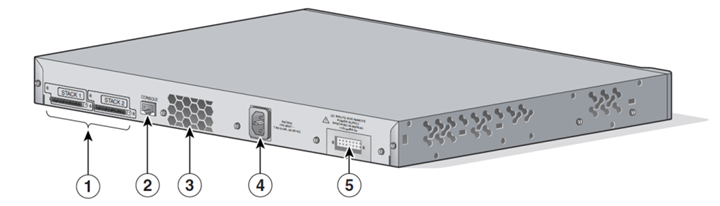

# Generales

Para poder acceder a la terminal puede ingresar por medio del protocolo “SSH” o “Telnet” por medio de una dirección IP o en su defecto por la interface de consola que se ubica en la parte trasera del dispositivo usando un adaptador serial.



## Teclas de acceso rápido

Al presionar la tecla “tabulador” dentro de la terminal del Switch la instrucción será completada siempre y cuando no exista ambigüedad causada por más de una instrucción similar.

## Ayuda

Para completar la sintaxis de un comando sin recordar todas sus variaciones basta con usar el carácter de interrogación “?” en la parte desconocida de la instrucción para recibir ayuda dentro de la consola.

## Usuario privilegiado

Para poder efectuar configuraciones tendrá que iniciar como usuario privilegiado utilizando la instrucción “enable” y “configure terminal”

```shell
Switch>enable
Switch#configure terminal
```

La diferencia se puede notar por el indicador de terminal

| | |
|---|---|
| Switch> | Usuario sin privilegios de configuración |
| Switch# | Usuario con privilegios de configuración |

# Configuración del reloj

Existen varias alternativas para ajustar el reloj interno del dispositivo a continuación, las mencionaremos.

## Configuración manual

```shell
Switch#clock set 12:49:00 03 May 2017
```

## Configuración de la zona horaria

La zona horaria CST -6 corresponde a la ciudad de México sin considerar el horario de verano. El cual reduce una hora en el periodo comprendido entre el primer domingo de abril y el último domingo de octubre.

```shell
Switch#configure terminal
Switch(config)#clock timezone CST -6
Switch(config)#clock summer-time CDT recurring 1 Sunday April 1:00 last Sunday October 1:00
```

## Configuración de servidor de tiempo

Para poder habilitar esta opción el dispositivo switch debe contar con acceso a internet para lo cual véase el apartado “Configuración de puerta de acceso”

```shell
Switch#configure terminal
Switch(config)#ntp server time-a.nist.gov version 2
Switch(config)#ntp server time-b.nist.gov version 2
Switch(config)#ntp server time-c.nist.gov version 2
```

## Configuración de puerta de acceso

Las direcciones de la puerta de enlace y resolución de nombres pueden cambiar dependiendo de la configuración de su red.

```shell
Switch#configure terminal
Switch(config)#ip default-gateway 192.168.30.14
Switch(config)#ip name-server 148.204.103.2 148.204.198.2 148.201.235.2
```

## Configuración inicial de seguridad

Los valores resaltados en negritas pueden ser variados de acuerdo a las políticas de la organización y la contraseña mostrada en el siguiente ejemplo es solo una muestra.
En resumen, habilita la conexión por el protocolo **ssh**, deshabilitando el protocolo telnet en todas las líneas vty y se asigna una dirección IP (**192.168.30.13**) al interior de la **vlan 30** y deshabilita el acceso por la **vlan 1**.

Genera un certificado de seguridad RSA de 2048 bits, el más seguro de este dispositivo. Y guarda la configuración de manera permanente en la configuración de inicio. Por lo que puede ser reiniciado sin perder la configuración.

```shell
Switch#configure terminal
Switch(config)#ip ssh version 2
Switch(config)#ip ssh authentication-retries 2
Switch(config)#ip domain name state.gov.ca
Switch(config)#crypto key generate rsa
The name for the keys will be: Switch.state.gov.ca
Choose the size of the key modulus in the range of 360 to 2048 for your
General Purpose Keys. Choosing a key modulus greater than 512 may take
a few minutes.

How many bits in the modulus [512]: 2048
% Generating 2048 bit RSA keys, keys will be non-exportable...[OK]

Switch(config)#interface vlan 30
Switch(config-if)#ip address 192.168.30.13 255.255.255.240
Switch(config-if)#username admin priv 15 secret P@ssw0rd1
Switch(config)#aaa new-model
Switch(config)#enable secret P@ssw0rd2
Switch(config)#line vty 0 15
Switch(config-line)#transport input ssh
Switch(config-line)#end

Switch#configure terminal
Switch(config)#interface vlan 1
Switch(config-if)#no ip address
Switch(config-if)#end

Switch#copy running-config startup-config
Destination filename [startup-config]?
Building configuration...
[OK]
Switch#
```

# Virtual Local Area Network

Una Virtual LAN o VLAN es una red virtual separada por etiquetas que se encuentran identificadas por un numero entero que va desde 0 hasta 4094. Regularmente son utilizadas para separar departamentos, áreas o zonas de trabajo.

## Creación de VLAN

A continuación, crearemos tres VLANs una para acceso a internet (Id 10) otra para el área de servidores (Id 20) y otra para las estaciones de trabajo (Id 30).

```shell
Switch>enable
Switch#configure terminal

Switch(config)#vlan 10
Switch(config-vlan)#name Internet
Switch(config-vlan)#end

Switch(config)#vlan 20
Switch(config-vlan)#name Servidores
Switch(config-vlan)#end

Switch(config)#vlan 30
Switch(config-vlan)#name "Estaciones de trabajo"
Switch(config-vlan)#end
```

## Mostrar VLANs

```shell
Switch#show vlan brief
```

```shell
VLAN Name                             Status    Ports
---- -------------------------------- --------- -------------------------------
1    default                          active
10   Internet                         active    Gi0/1
20   Servidores                       active    Fa0/13, Fa0/14, Fa0/15, Fa0/16
                                                Fa0/17, Fa0/18, Fa0/19, Fa0/20
                                                Fa0/21, Fa0/22
30   Estaciones de trabajo            active    Fa0/1, Fa0/2, Fa0/3, Fa0/4
                                                Fa0/5, Fa0/6, Fa0/7, Fa0/8
                                                Fa0/9, Fa0/10, Fa0/11, Fa0/12
1002 fddi-default                     act/unsup
1003 token-ring-default               act/unsup
1004 fddinet-default                  act/unsup
1005 trnet-default                    act/unsup
Switch#
```

```shell
Switch#show vlan
```

```shell
VLAN Name                             Status    Ports
---- -------------------------------- --------- -------------------------------
1    default                          active
10   Internet                         active    Gi0/1
20   Servidores                       active    Fa0/13, Fa0/14, Fa0/15, Fa0/16
                                                Fa0/17, Fa0/18, Fa0/19, Fa0/20
                                                Fa0/21, Fa0/22
30   Estaciones de trabajo            active    Fa0/1, Fa0/2, Fa0/3, Fa0/4
                                                Fa0/5, Fa0/6, Fa0/7, Fa0/8
                                                Fa0/9, Fa0/10, Fa0/11, Fa0/12
1002 fddi-default                     act/unsup
1003 token-ring-default               act/unsup
1004 fddinet-default                  act/unsup
1005 trnet-default                    act/unsup

VLAN Type  SAID       MTU   Parent RingNo BridgeNo Stp  BrdgMode Trans1 Trans2
---- ----- ---------- ----- ------ ------ -------- ---- -------- ------ ------
1    enet  100001     1500  -      -      -        -    -        0      0
10   enet  100010     1500  -      -      -        -    -        0      0
20   enet  100020     1500  -      -      -        -    -        0      0
30   enet  100030     1500  -      -      -        -    -        0      0
1002 fddi  101002     1500  -      -      -        -    -        0      0
1003 tr    101003     1500  -      -      -        -    -        0      0
1004 fdnet 101004     1500  -      -      -        ieee -        0      0
1005 trnet 101005     1500  -      -      -        ibm  -        0      0

Remote SPAN VLANs
------------------------------------------------------------------------------


Primary Secondary Type              Ports
------- --------- ----------------- ------------------------------------------
```

```shell
Switch#show vlan id 20
```

```shell
VLAN Name                             Status    Ports
---- -------------------------------- --------- -------------------------------
20   Servidores                       active    Fa0/13, Fa0/14, Fa0/15, Fa0/16
                                                Fa0/17, Fa0/18, Fa0/19, Fa0/20
                                                Fa0/21, Fa0/22, Fa0/23, Gi0/2

VLAN Type  SAID       MTU   Parent RingNo BridgeNo Stp  BrdgMode Trans1 Trans2
---- ----- ---------- ----- ------ ------ -------- ---- -------- ------ ------
20   enet  100020     1500  -      -      -        -    -        0      0

Remote SPAN VLAN
----------------
Disabled

Primary Secondary Type              Ports
------- --------- ----------------- ------------------------------------------
```

Borrar VLANs

```shell
Switch(config)#no vlan 35
```

**Fuente**

https://www.cisco.com/c/en/us/td/docs/switches/lan/catalyst2960/software/release/12-2_55_se/configuration/guide/scg_2960/swvlan.html

# Listas de control de acceso
Las listas de control de acceso están diseñadas para evitar el acceso desde direcciones de red específicas por una o varias interfaces.

## Creación de lista de control de acceso

A continuación, crearemos una lista de control de acceso que impida el acceso desde direcciones de red privadas por una interface Gigabit Ethernet.

```shell
Switch(config)#ip access-list extended BLACK_LIST
Switch(config-ext-nacl)#deny ip 127.0.0.0 0.255.255.255 any
Switch(config-ext-nacl)#deny ip 192.168.0.0 0.0.255.255 any
Switch(config-ext-nacl)#deny ip host 0.0.0.0 any
Switch(config-ext-nacl)#permit ip any any
Switch(config-ext-nacl)#end
Switch#configure terminal
Switch(config)#interface GigabitEthernet 0/1
Switch(config-if)#ip access-group BLACK_LIST in
Switch(config-if)#end
```

## Mostrar listas de control de acceso

```shell
Switch#show access-list
```

```shell
Extended IP access list BLACK_LIST
    10 deny ip 127.0.0.0 0.255.255.255 any
    20 deny ip 192.168.0.0 0.0.255.255 any
    30 deny ip host 0.0.0.0 any
    40 permit ip any any (4796371 matches)
Switch#
```

## Eliminar listas de control de acceso

```shell
Switch(config)#no ip access-list extended BLACK_LIST
```

**Fuente**

https://www.cisco.com/c/en/us/td/docs/switches/lan/catalyst2960/software/release/12-2_55_se/configuration/guide/scg_2960/swacl.html

# Tablas de direccionamiento MAC

Esta tabla relaciona la dirección física de un equipo (MAC) con la dirección lógica (IP) y con el puerto por el cuan tienen acceso.

## Tiempo de actualización

Esta relación puede causar un problema en redes muy grandes debido a la cantidad de cambios. Ya que al apagar o prender un equipo este debe perder la asignación de IP al interior de un switch. Para mitigar este problema podemos ajustar manualmente el tiempo en que se dará de baja una dirección dentro del switch.

```shell
Switch(config)#mac address-table aging-time 120 vlan 10
```

## Definir rutas estáticas

Esta puede resultar una excelente técnica de mitigación contra la usurpación de la puerta de acceso al interior de una red de trabajo.

```shell
Switch#mac address-table static 50e5.4939.a241 vlan 10 interface GigabitEthernet 0/2
Switch#mac address-table static 50e5.4939.a241 vlan 20 interface GigabitEthernet 0/2
Switch#mac address-table static 50e5.4939.a241 vlan 30 interface GigabitEthernet 0/2
```

## Eliminar rutas estáticas

```shell
Switch#no mac address-table static 50e5.4939.a241 vlan 10 interface GigabitEthernet 0/2
```

## Mostrar tabla de direcciones MAC

```shell
Switch#show mac address-table
```

```shell
          Mac Address Table
-------------------------------------------

Vlan    Mac Address       Type        Ports
----    -----------       --------    -----
 All    0100.0ccc.cccc    STATIC      CPU
 All    0100.0ccc.cccd    STATIC      CPU
 All    0180.c200.0000    STATIC      CPU
 All    0180.c200.0001    STATIC      CPU
 All    0180.c200.0002    STATIC      CPU
 All    0180.c200.0003    STATIC      CPU
 All    0180.c200.0004    STATIC      CPU
  10    0004.2329.0dfa    DYNAMIC     Gi0/1
  10    0008.9bd2.08ef    DYNAMIC     Gi0/1
  10    000a.f788.1a2e    DYNAMIC     Gi0/1
  10    000c.29e9.479f    DYNAMIC     Gi0/1
  10    0011.3266.e7ff    DYNAMIC     Gi0/1
  10    0013.2028.3de4    DYNAMIC     Gi0/1
  10    0015.17b4.80c0    DYNAMIC     Gi0/1
  10    0015.17b4.80c1    DYNAMIC     Gi0/1
  10    0019.d102.761a    DYNAMIC     Gi0/1
  30    1c1b.0d06.b3aa    STATIC      Fa0/1
  30    50e5.4939.a141    STATIC      Gi0/2
  30    b4b5.2fb6.93eb    STATIC      Fa0/5
  30    b888.e3d6.0ebb    STATIC      Fa0/1
  30    e839.353e.82d5    STATIC      Fa0/11
Total Mac Addresses for this criterion: 14
```

```shell
Switch#show mac address-table vlan 20
```

```shell
Switch#show mac address-table interface Gi0/1
```

```shell
Switch#show mac address-table address fcaa.149a.fd50
```

**Fuente**

https://www.cisco.com/c/m/en_us/techdoc/dc/reference/cli/nxos/commands/l2/mac-address-table-static.html 

# Configuración de puertos

## Puertos de acceso

Los puertos de acceso son puertos físicos que solo habitan en una VLAN y su finalidad es la conexión a equipos terminales. Como son equipos de trabajo, puntos de acceso, teléfonos VoIP, video cámaras IP o algunas impresoras en red.

```shell
Switch(config)#interface FastEthernet 0/23
```

Una buena práctica para ahorrar trabajo al administrar configuraciones de puerto es aplicarla a un rango de interfaces.

```shell
Switch(config)#interface range FastEthernet 0/1 - 22
```

Definir explícitamente el uso que se le dará al puerto puede ayudar a evitar problemas de seguridad.

```shell
Switch(config-if-range)#switchport mode access
```

Establecemos la VLAN en la que habitaran los puertos de acceso

```shell
Switch(config-if-range)#switchport access vlan 30
```

Definimos las políticas de seguridad en el puerto
* Máximo 2 direcciones físicas podrán existir en este puerto
* La interface al superar el número de direcciones fisicas: Dejara de contestar paquetes y quedara en estado err-disabled
* Al no tener direcciones físicas aprenderá las que sean conectadas.
* Elimina las direcciones aprendidas por la interface después de 60 minutos de inactividad.

```shell
Switch(config-if-range)#switchport port-security
Switch(config-if-range)#switchport port-security maximum 2
Switch(config-if-range)#switchport port-security violation protect
Switch(config-if-range)#switchport port-security mac-address sticky

Switch(config-if-range)#switchport port-security aging time 60
Switch(config-if-range)#switchport port-security aging type inactivity
```

**Nota:** Estas políticas son definidas en términos generales para evitar que equipos de terceros al conectarse a un puerto puedan tener acceso a una VLAN. Sin embargo, se pueden cambiar la configuración para volverse más restrictivas de acuerdo al uso para el que este destinado el switch.

Definimos la etiqueta de uso correspondiente para este dispositivo, este elemento no es funcional sin embargo es útil para la interface web el conocer el uso del puerto.

```shell
Switch(config-if-range)#macro description cisco-desktop
```

Habilitar el protocolo spanning-tree para evitar conectar cables entre las interfaces del mismo dispositivo o entre dispositivos de una misma VLAN lo que provocaría Loops infinitos y un alto consumo de recursos.

```shell
Switch(config-if-range)#spanning-tree portfast
Switch(config-if-range)#spanning-tree bpduguard enable
```


## Puertos de acceso

Los puertos troncales a diferencia de los de acceso tienen la peculiaridad de permitir mas de una red virtual por la misma interface. Regularmente son utilizados para transmitir comunicaciones entre dispositivos de comunicación y de distribución.

La siguiente configuración define un puerto troncal ubicado en la interface GigabitEthernet 2 del presente modulo. Permitiendo todas las redes virtuales “vlan all” y usando la descripción de un Router. 

```shell
Switch(config)#interface GigabitEthernet 0/2
Switch(config-if)#switchport mode trunk
Switch(config-if)#switchport trunk allowed vlan all
Switch(config-if)#macro description cisco-router
Switch(config-if)#end
```

## Puertos dinámicos
Es una tecnología propietaria de CISCO el cual automatiza la configuración de etiquetado de redes. Sin embargo, es una mala práctica debido a que permite ataques de doble etiquetado o “VLan Hopping”.

# Recuperación de errores

Cuando se produce una violación de puerto por alguna de las políticas de seguridad en puerto implementadas.

## Mostrar estado de la interface

```shell
Switch#show interface FastEthernet 0/13 status
```

Interface FastEthernet 13 se encuentra deshabilitado

```shell
Port      Name               Status        Vlan       Duplex  Speed Type
Fa0/13                       err-disabled  20           full    100 10/100BaseTX
Switch#
```

Para mostrar errores específicos de una interface

```shell
Switch#show port-security interface FastEthernet 0/13
```

Interface FastEthernet 13 sin errores

```shell
Port Security              : Enabled
Port Status                : Secure-down
Violation Mode             : Protect
Aging Time                 : 120 mins
Aging Type                 : Inactivity
SecureStatic Address Aging : Disabled
Maximum MAC Addresses      : 1
Total MAC Addresses        : 1
Configured MAC Addresses   : 0
Sticky MAC Addresses       : 1
Last Source Address:Vlan   : 1c1b.0d06.b49f:10
Security Violation Count   : 0
```

## Restaurar interface

Para recuperar el puerto basta con apagar y prender el puerto.

```shell
Switch#configure terminal
Switch(config)#interface FastEthernet 0/13
Switch(config-if)#shutdown
Switch(config-if)#no shutdown
Switch(config-if)#end
```

**Fuente**

https://www.cisco.com/c/es_mx/support/docs/lan-switching/spanning-tree-protocol/69980-errdisable-recovery.html

## Restaurar interface por violación de puerto

### Para mostrar las direcciones aprendidas de los puertos

```shell
Switch#show port address
```

```shell
               Secure Mac Address Table
-----------------------------------------------------------------------------
Vlan    Mac Address       Type                          Ports   Remaining Age
                                                                   (mins)
----    -----------       ----                          -----   -------------
  30    1c1b.0d06.b4ba    SecureSticky                  Fa0/1        -
  30    b888.e3d6.1eab    SecureSticky                  Fa0/1        -
  30    0025.ab42.9132    SecureSticky                  Fa0/2        -
  30    0800.27bc.94c0    SecureSticky                  Fa0/2        -
  30    1c1b.0d06.244e    SecureSticky                  Fa0/3        -
  30    1c39.47b3.7a2e    SecureSticky                  Fa0/3        -
  30    b4b5.2fb6.94ea    SecureSticky                  Fa0/5        -
  30    1c1b.0d05.27f5    SecureSticky                  Fa0/7        -
  30    2880.23e8.8a1c    SecureSticky                  Fa0/7        -
  30    0800.27e8.078b    SecureSticky                  Fa0/9        -
  30    1c1b.0d05.2963    SecureSticky                  Fa0/9        -
  30    28d2.447c.630c    SecureSticky                  Fa0/10       -
  30    e839.353e.84c5    SecureSticky                  Fa0/11       -
  20    1c1b.0d06.244e    SecureSticky                  Fa0/15       -
  20    50e5.4939.a8c8    SecureSticky                  Fa0/17       -
  20    1c1b.0d05.2806    SecureSticky                  Fa0/19       -
-----------------------------------------------------------------------------
Total Addresses in System (excluding one mac per port)     : 5
Max Addresses limit in System (excluding one mac per port) : 8192
```

Desbloquear el puerto en caso de violación por direcciones aprendidas

### Para mostrar las direcciones aprendidas de los puertos

```shell
Switch#show port-security
```

```shell
Secure Port  MaxSecureAddr  CurrentAddr  SecurityViolation  Security Action
                (Count)       (Count)          (Count)
---------------------------------------------------------------------------
      Fa0/1              2            2                  0          Protect
      Fa0/2              2            2                  0          Protect
      Fa0/3              2            2                  0          Protect
      Fa0/4              2            0                  0          Protect
      Fa0/5              2            1                  0          Protect
      Fa0/6              2            0                  0          Protect
      Fa0/7              2            2                  0          Protect
      Fa0/8              2            0                  0          Protect
      Fa0/9              2            2                  0          Protect
     Fa0/10              2            1                  0          Protect
     Fa0/11              2            1                  0          Protect
     Fa0/12              2            0                  0          Protect
     Fa0/13              1            0                  0          Protect
     Fa0/14              1            0                  0          Protect
     Fa0/15              1            1                  0          Protect
     Fa0/16              1            0                  0          Protect
     Fa0/17              1            1                  0          Protect
     Fa0/18              1            0                  0          Protect
     Fa0/19              1            1                  0          Protect
     Fa0/20              1            0                  0          Protect
     Fa0/21              1            0                  0          Protect
     Fa0/22              1            0                  0          Protect
---------------------------------------------------------------------------
Total Addresses in System (excluding one mac per port)     : 5
Max Addresses limit in System (excluding one mac per port) : 8192
Switch#
```

```shell
Switch#clear port-security sticky interface FastEthernet 0/13
```

**Fuente**

https://www.cisco.com/c/en/us/td/docs/switches/lan/catalyst4500/12-2/20ewa/configuration/guide/conf/port_sec.html

